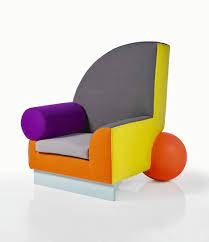

# Postmodernes Design 

> Alessandro Mendini  (Aug 1931, Milan - Feb 2019, Milan) 
> Ettore Sottsass (Sep 1919, Innsbruck - Dez 2007, Milan)

## Ettore Sottsass

  
Ettore Sottsass, geboren im September 1919 in Innsbruck, Österreich-Ungarn, gestorben im Dezember 2007 in Milan, Italien, war ein Italienischer Architekt, der Postmoderne, er hat u.a. die Schreibmaschine "Valentine" und die Skulptur "Faktotum" entworfen. 

 
Schreibmaschine "Valentine"

Skulptur "Faktotum"

## Alessandro Mendini

  
Alessandro Mendini, geboren im August 1931 in Milan, Italien, gestorben im Februar 2019 in Milan, Italien, war ein Italienischer Architekt der im Postmodernen Stil gearbeitet hat; er entwarf u.a. Das Groninger Museum und Designte den Sessel von Gropius neu & nannte in "Wassily". 

Sessel "Wassily". 

Das Groninger Museum 

## Die Postmoderne

Die Postmoderne war ein Versuch, sich von dem praktischen, gestummten, komischen und unpersonalen Ansatz der Moderne loszulösen; 
die Bewegung entstand aus der Architektur in den späten 1960ern und hatte ihre Hoch-zeit zwischen 1970 und 1990. 

Die Experimentierfreudige, individualistische Bewegung kann man meist an den Matten, warmen Pastellfarben, den Materialien Leder, Glas, Plastik und Acryl und an den meist einfachen, inorganischen Formen erkennen, die Zusammen meißt ziemlich surreal (= unecht) wirken können.

Die Postmoderne versucht auch Form und Funktion zu entkoppeln, so dass die Funktion nicht zwingend der Form oder die Form der Funktion folgen muss; bei ihr ist die Form dabei meißt im Vordergrund. 

Dies kann man auch recht gut bei dem Sessel "Bel Air" von Peter Shire sehen.  
 

